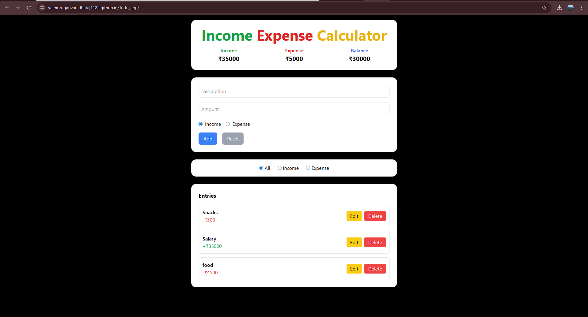

# Income Expense Calculator

A simple income and expense tracker built with HTML, TailwindCSS, and JavaScript.  
This project allows users to add, edit, delete, and filter financial records, while also showing total income, total expenses, and balance.  

## Features
- Add income/expense entries with description & amount
- Edit and delete entries
- Filter entries by `All`, `Income`, or `Expense`
- View total income, expense, and balance
- Data persisted in **LocalStorage**
- Responsive design (mobile + desktop)
- Reset button to clear form

## Tech Stack
- HTML  
- TailwindCSS  
- JavaScript 

## Usage
1. Open `index.html` in a browser.
2. Add your income or expense.
3. Use filters to view specific records.
4. Refresh the page — your data persists.

# Income Expense Calculator

---
